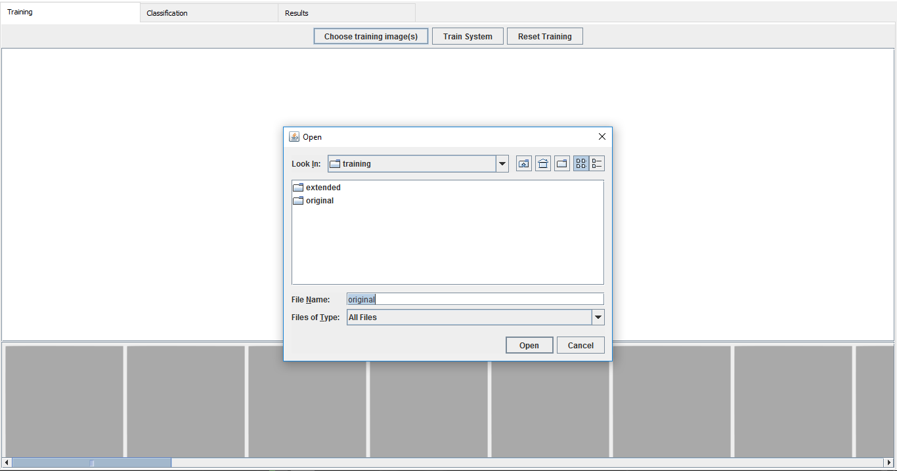
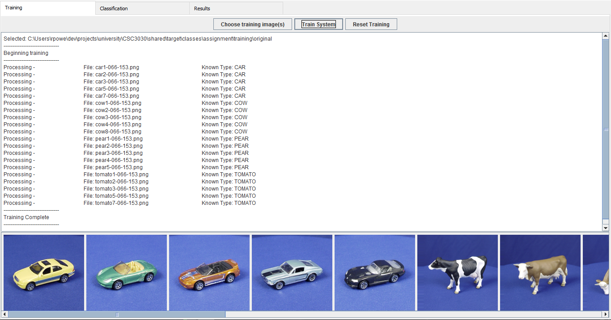
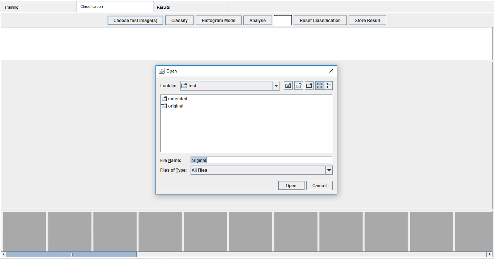
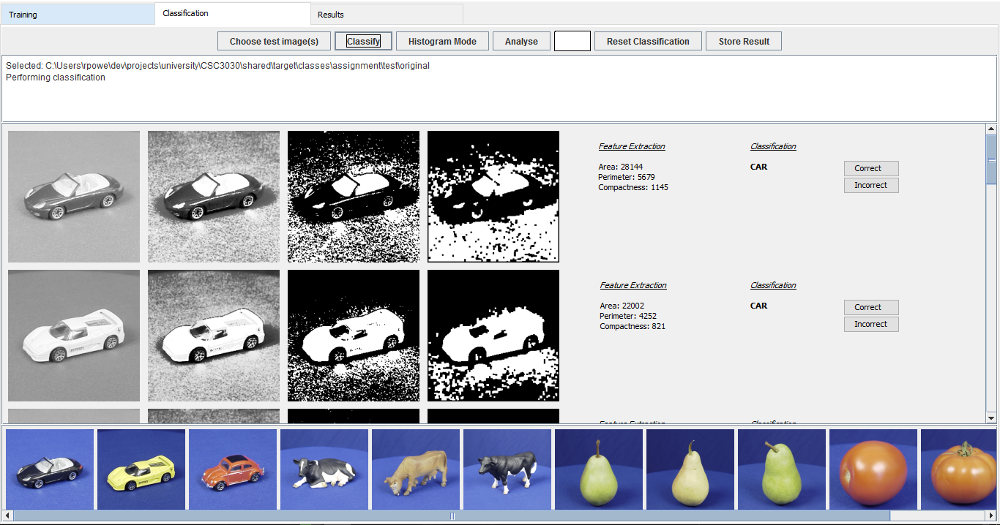
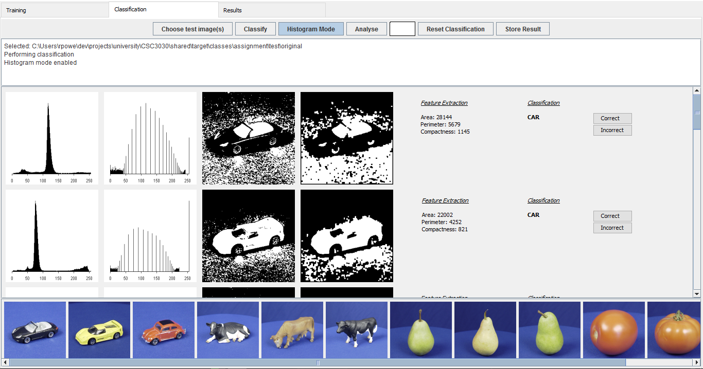
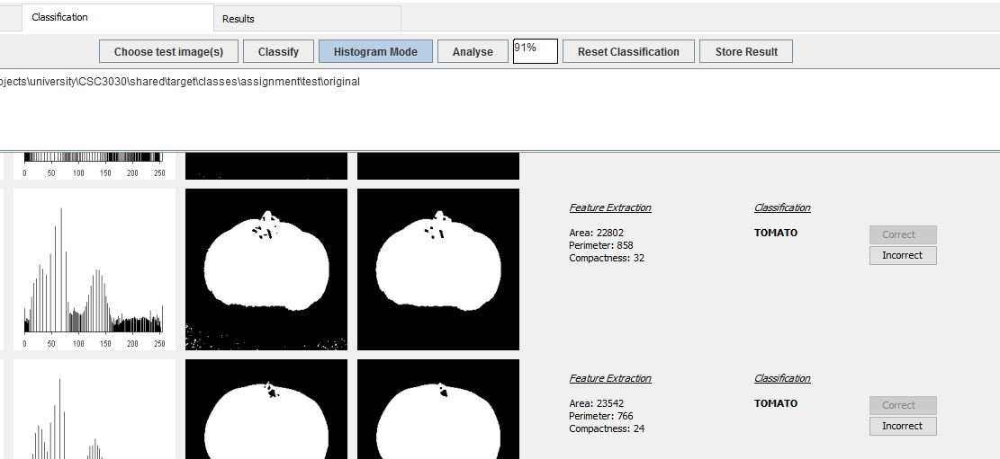
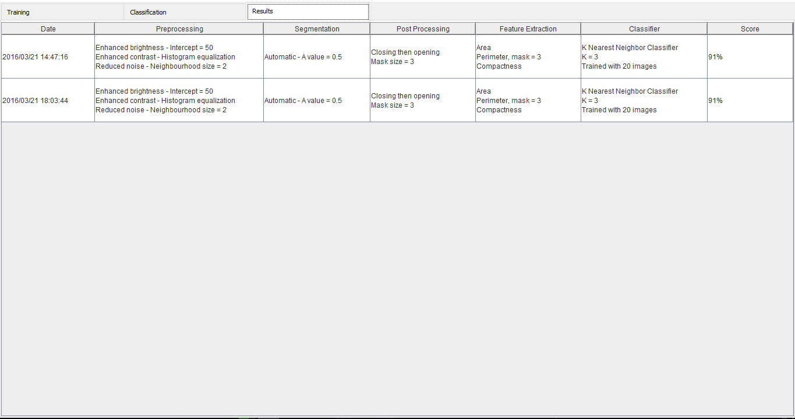

## Automated Image Processing System
###### Group repository for CSC3030 assignment :+1:

#### To use in intellij:
* Open -> Select the pom.xml file in the base directory and let the project index itself.
* Select the maven projects pane -> CSC3030 -> Lifecycle -> install
  * This will download the projects dependencies, compile, run unit tests, and package the application.
  * The main class can then be ran:
  ```
  ui/src/main/java/ui/App.java
  ```

#### Tutorial
* Press *"Choose training image(s)"* to select the directory of images to train the system


* Press *"Train System"* to train the system


* Move to the classification tab and press *"Choose test image(s)"* to select the directory of images to test the system


* Press *"Classify"* to test the system


* Press *"Histogram Mode"* to activate histogram mode


* To analyse the results, use the correct / incorrect buttons and press *"Analyse"* to get recognition rate


* To save the result press *"Store Result"* and navigate to the results tab
